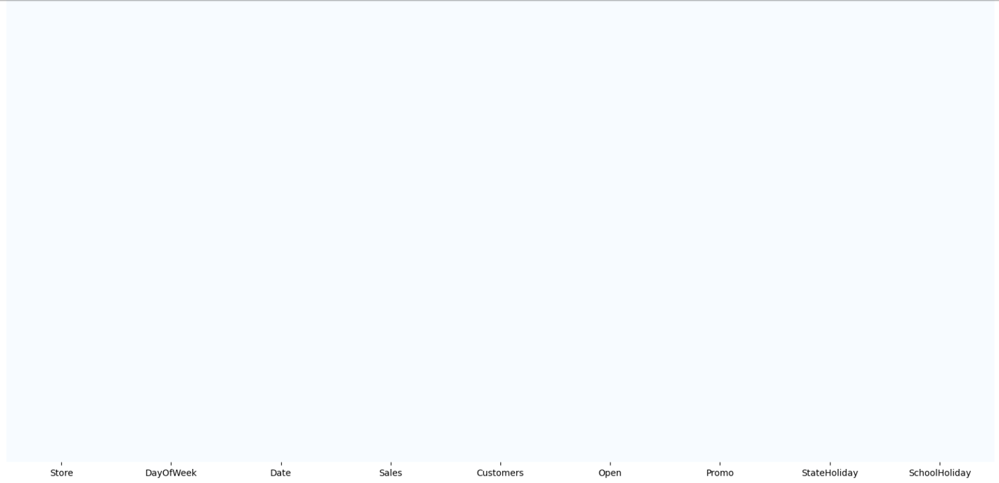
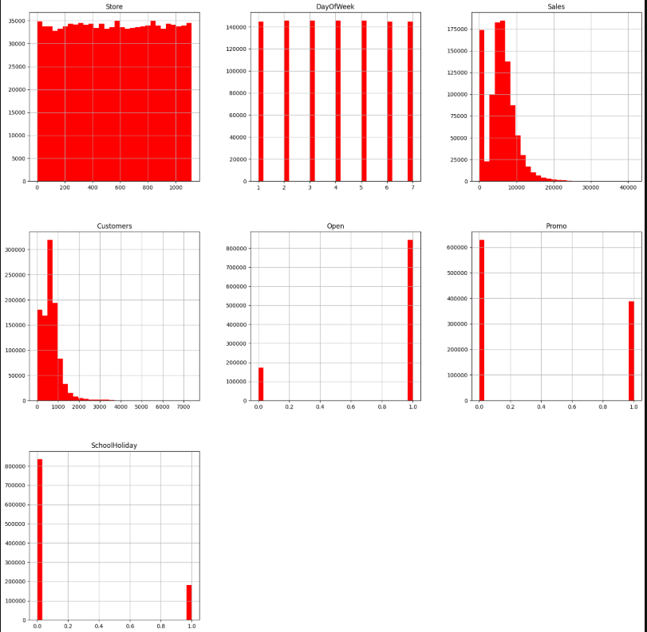
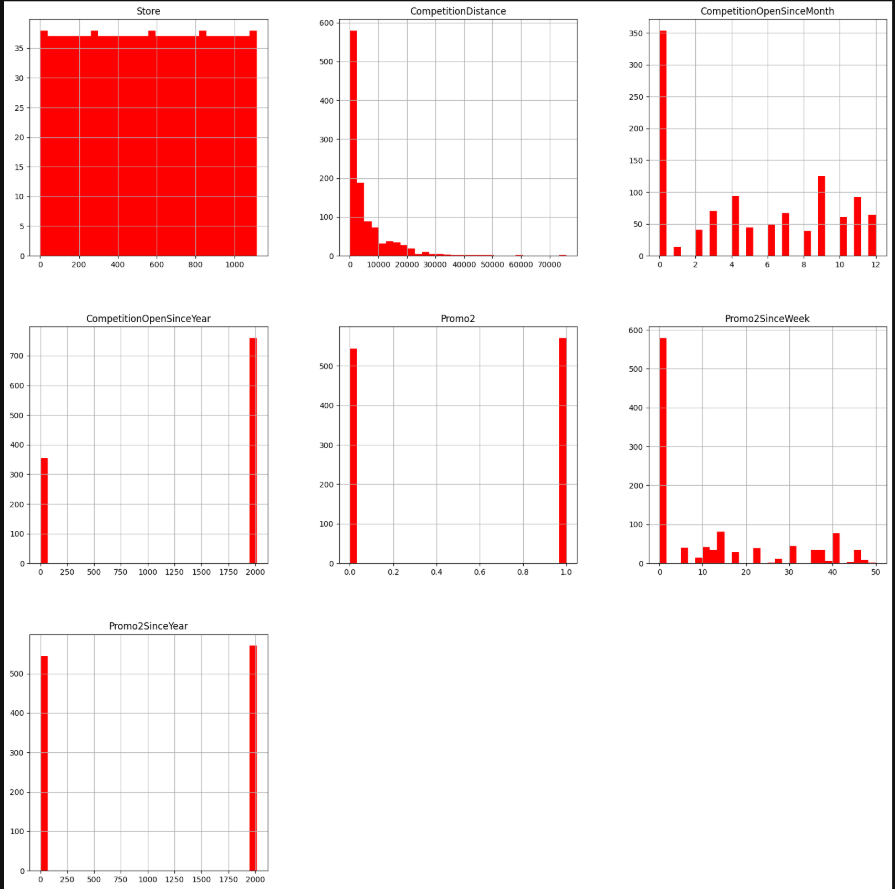

# Sales-Analysis-Prediction
This project performs exploratory data analysis (EDA) and sales forecasting for a retail dataset. It leverages Python libraries such as Pandas, Matplotlib, Seaborn, and Facebook Prophet to analyze sales trends and predict future sales.

## 🔎 Dataset Overview  

The dataset contains the following important columns:  

- **Store** → Store ID  
- **DayOfWeek** → Day of the week (1 = Monday, 7 = Sunday)  
- **Date** → Transaction date  
- **Sales** → Total sales amount (Target variable)  
- **Customers** → Number of customers  
- **Open** → Whether the store was open (1 = Open, 0 = Closed)  
- **Promo** → Whether a promotion was running  
- **StateHoliday / SchoolHoliday** → Holiday indicators  
- **CompetitionDistance / CompetitionOpenSince** → Competition-related features  
- **Promo2 / Promo2Since** → Additional promotion details  

---

## 📊 Exploratory Data Analysis (EDA)  

### Feature Distributions  
  

### Sales & Customer Patterns  
  

### Competition & Promotion Impact  
  

---

## ⚙️ Technologies Used  

- **Python** (pandas, numpy, matplotlib, seaborn)  
- **Jupyter Notebook**  
- **Data Visualization** for EDA  

---

## 🚀 How to Run  

1. Clone this repository:  
   ```bash
   git clone https://github.com/your-username/sales-analysis.git
   cd sales-analysis

